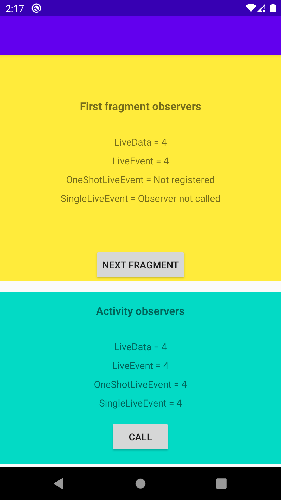

[](https://jitpack.io/#javaherisaber/LiveX)
# LiveX

Collection of LiveData extensions for android



# Dependency
Top level build.gradle
```groovy
allprojects {
   repositories {
    ...
    maven { url 'https://jitpack.io' }
  }
}
```

Module level build.gradle
```groovy
dependencies {
  implementation "com.github.javaherisaber:LiveX:$versions.liveX"
}
```
